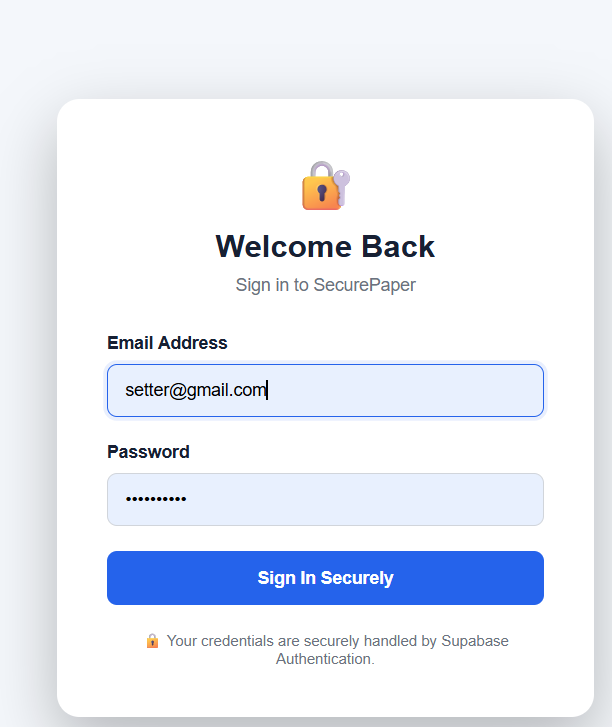
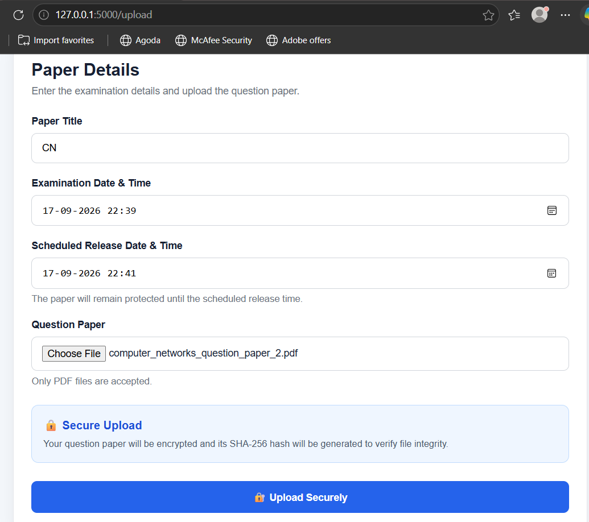
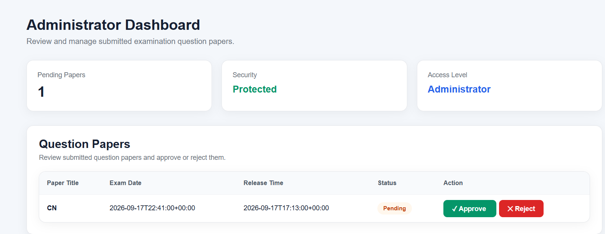
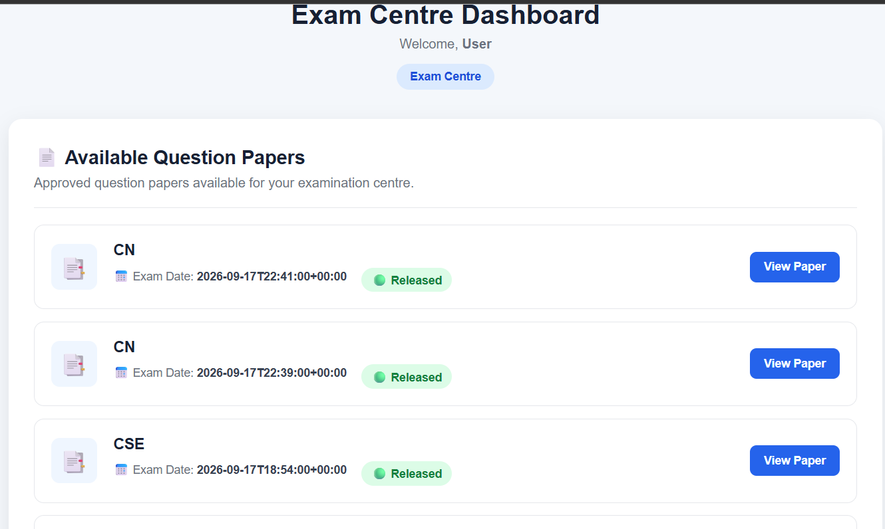

# SecurePaper - Secure Question Paper Management System

## 1. Project Title

**SecurePaper - Secure Question Paper Management System**

---

## 2. Brief Description

SecurePaper is a secure web-based Question Paper Management System developed using Python Flask and Supabase.

The system provides three different user roles:

* **Question Setter**
* **Administrator**
* **Exam Centre**

The Question Setter can upload question papers securely. The Administrator can review and approve or reject the uploaded papers. The Exam Centre can access approved question papers only after the scheduled release time.

The system uses encryption, hashing, authentication, role-based access control, and secure storage to protect examination question papers.

---

## 3. Technologies and Tools Used

### Programming Language

* Python

### Backend

* Flask

### Frontend

* HTML5
* CSS3

### Database and Backend Services

* Supabase
* PostgreSQL
* Supabase Authentication
* Supabase Storage

### Security Technologies

* Fernet Encryption
* SHA-256 Hashing
* Role-Based Access Control
* Row Level Security (RLS)

### Development Tools

* Visual Studio Code
* Git
* GitHub

---

## 4. Installation and Setup

### Step 1: Clone the Repository

Open a terminal and run:

```bash
git clone https://github.com/YOUR-USERNAME/SecurePaper.git
```

Navigate to the project folder:

```bash
cd SecurePaper
```

### Step 2: Create a Virtual Environment

```bash
python -m venv venv
```

### Step 3: Activate the Virtual Environment

For Windows:

```bash
venv\Scripts\activate
```

For Linux/macOS:

```bash
source venv/bin/activate
```

### Step 4: Install Dependencies

```bash
pip install -r requirements.txt
```

---

## 5. Supabase Configuration

Create a Supabase project and configure the following services:

* Supabase Authentication
* PostgreSQL Database
* Supabase Storage
* Row Level Security

Create a **private storage bucket** with the following name:

```text
question-papers
```

The system supports the following roles:

```text
question_setter
administrator
exam_centre
```

---

## 6. Environment Variables

Create a `.env` file in the project root directory.

Add the following:

```env
SUPABASE_URL=your_supabase_url
SUPABASE_KEY=your_supabase_key
FLASK_SECRET_KEY=your_flask_secret_key
ENCRYPTION_KEY=your_fernet_encryption_key
```

Replace the values with the credentials from your Supabase project.

**Note:** The `.env` file contains sensitive information and should not be uploaded to GitHub.

---

## 7. Generate Encryption Key

SecurePaper uses Fernet encryption to protect question papers.

Open Python:

```bash
python
```

Run:

```python
from cryptography.fernet import Fernet

key = Fernet.generate_key()
print(key.decode())
```

Copy the generated key and add it to the `.env` file:

```env
ENCRYPTION_KEY=your_generated_key
```

---

## 8. Running the Project

Activate the virtual environment:

```bash
venv\Scripts\activate
```

Run the Flask application:

```bash
python app.py
```

The application will run at:

```text
http://127.0.0.1:5000
```

Open the above address in a web browser.

To stop the application:

```text
Ctrl + C
```

---

## 9. Project Structure

```text
SecurePaper/
│
├── app.py
│   └── Main Flask application.
│       Handles login, authentication,
│       authorization, question paper upload,
│       encryption, approval, release time,
│       decryption and paper viewing.
│
├── requirements.txt
│   └── Contains all required Python packages.
│
├── README.md
│   └── Project documentation.
│
├── .gitignore
│   └── Prevents sensitive files such as
│       .env and virtual environment files
│       from being uploaded to GitHub.
│
├── static/
│   └── style.css
│       └── Contains CSS styling for the website.
│
└── templates/
    │
    ├── login.html
    │   └── Login page for users.
    │
    ├── profile.html
    │   └── Displays the logged-in user's profile.
    │
    ├── upload.html
    │   └── Question Setter upload page.
    │
    ├── upload_success.html
    │   └── Displays successful upload message.
    │
    ├── admin.html
    │   └── Administrator dashboard for
    │       approving or rejecting papers.
    │
    └── centre.html
        └── Exam Centre dashboard for
            viewing released question papers.
```

---

## 10. Project Modules

### 1. Authentication Module

Users log in using Supabase Authentication.

The system identifies the logged-in user and verifies their role before providing access to different modules.

---

### 2. Question Setter Module

The Question Setter can:

* Log in to the system.
* Upload a question paper in PDF format.
* Enter the question paper title.
* Enter the examination date.
* Set the release date and time.
* Submit the paper for administrator approval.

Before storage, the question paper is hashed and encrypted.

---

### 3. Administrator Module

The Administrator can:

* View uploaded question papers.
* Review pending question papers.
* Approve question papers.
* Reject question papers.

Only approved papers can be accessed by the Exam Centre after the scheduled release time.

---

### 4. Exam Centre Module

The Exam Centre can:

* Log in to the system.
* View approved question papers.
* Check whether a paper has been released.
* Access the question paper after the release time.
* View the decrypted PDF.

---

### 5. Encryption and Security Module

The uploaded PDF is encrypted using **Fernet symmetric encryption** before being stored in Supabase Storage.

A **SHA-256 hash** is also generated for the original PDF.

This provides an additional mechanism for maintaining file integrity.

---

### 6. Scheduled Release Module

Each question paper contains a scheduled release date and time.

The server checks the current UTC time against the configured release time.

The Exam Centre cannot access the paper before the scheduled release time.

---

## 11. System Workflow

```text
Question Setter
       |
       v
Upload Question Paper
       |
       v
Generate SHA-256 Hash
       |
       v
Encrypt PDF using Fernet
       |
       v
Store Encrypted File
       |
       v
Administrator Review
       |
       +----------------+
       |                |
       v                v
    Reject           Approve
                         |
                         v
                  Scheduled Release
                         |
                         v
                    Release Time
                         |
                         v
                    Exam Centre
                         |
                         v
                  Access Validation
                         |
                         v
                   Decrypt PDF
                         |
                         v
                     View Paper
```

---

## 12. Security Features

### Authentication

Supabase Authentication is used to authenticate users securely.

### Role-Based Access Control

The system provides different access permissions for:

* Question Setter
* Administrator
* Exam Centre

### Encryption

Question papers are encrypted using Fernet before being stored.

### SHA-256 Hashing

A SHA-256 hash is generated for each original question paper.

### Private Storage

Encrypted question papers are stored in a private Supabase Storage bucket.

### Row Level Security

Supabase Row Level Security policies are used to control access to database and storage resources.

### Release-Time Protection

The server verifies the configured release time before allowing the Exam Centre to view a question paper.

### Environment Variables

Sensitive credentials and encryption keys are stored in environment variables instead of being hard-coded in the application.

---

## 13. Sample Input

A Question Setter uploads a question paper using the following details:

```text
Title:
Data Structures and Algorithms

File:
data_structures.pdf

Exam Date:
2026-10-10

Release Time:
2026-10-10 09:00
```

The system generates a SHA-256 hash and encrypts the uploaded PDF before storing it.

Example stored information:

```text
Title: Data Structures and Algorithms
Exam Date: 2026-10-10
Status: Pending
Storage Path: papers/<generated-file-id>.enc
SHA-256 Hash: <generated-hash>
```

---

## 14. Sample Output

### After Upload

```text
Upload Successful

Your question paper has been uploaded securely
and is awaiting administrator approval.
```

### Before Administrator Approval

```text
Status: Pending
```

### After Administrator Approval

```text
Status: Approved
```

### Before Release Time

The Exam Centre sees:

```text
Data Structures and Algorithms

Exam Date: 2026-10-10

Status: Scheduled

Access: Not Released
```

### After Release Time

The Exam Centre sees:

```text
Data Structures and Algorithms

Exam Date: 2026-10-10

Status: Released

Access: View Paper
```

When **View Paper** is selected, the system verifies the user's role, approval status, and release time. The encrypted question paper is then decrypted and displayed as a PDF.

---
## Screenshots

### Login Page



### Question Paper Upload



### Administrator Dashboard



### Exam Centre Dashboard



## 15. Example User Flow

```text
Login
  |
  v
Select User Role
  |
  +-------------------+
  |                   |
  v                   v
Question Setter    Administrator
  |                   |
  v                   v
Upload Paper       Review Paper
  |                   |
  v              Approve / Reject
Encrypt Paper         |
  |                   v
  +--------------> Approved
                       |
                       v
                  Release Time
                       |
                       v
                  Exam Centre
                       |
                       v
                   View PDF
```

---

## 16. Project Objective

The main objective of SecurePaper is to provide a secure and controlled platform for managing examination question papers.

The system helps protect question papers from:

* Unauthorized access
* Premature disclosure
* Unauthorized downloads
* Direct exposure of stored files
* Unauthorized access before the scheduled release time

The project combines authentication, authorization, encryption, hashing, secure storage, and scheduled release mechanisms.

---

## 17. Future Enhancements

The following features can be added in future versions:

* Email notifications
* Audit logs
* Administrator analytics dashboard
* Automatic release notifications
* User management
* Password recovery
* Advanced search and filtering
* Digital signatures
* Mobile-responsive improvements

---

## 18. Conclusion

SecurePaper provides a secure workflow for managing examination question papers.

Question papers are uploaded by authorized Question Setters, encrypted before storage, reviewed by Administrators, and made available to authorized Exam Centres only after the configured release time.

The project demonstrates the practical use of Flask, Supabase, PostgreSQL, authentication, encryption, hashing, role-based access control, secure storage, and scheduled access control in a real-world application.
